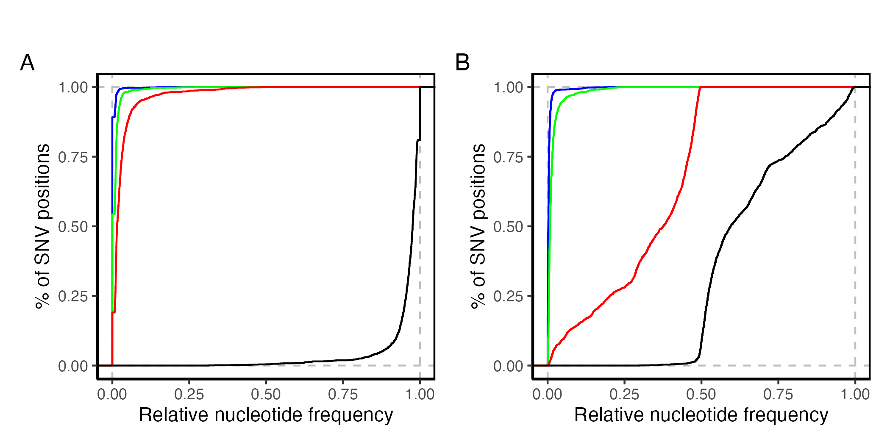

# A workflow for linking Nanopore reads using single nucleotide variants (SNV) to reconstruct genomic haplotypes of large dsDNA viruses

The figures and content in this repository are derived from the following publication:

**Wennmann, J.T., Lim, F.S., Senger, S., Gani, M., Jehle, J.A., Keilwagen, J (2024). Haplotype determination of the Bombyx mori nucleopolyhedrovirus by Nanopore sequencing and linkage of single nucleotide variants.** Journal of General Virology. 105 (5), 001983. [<https://doi.org/10.1099/jgv.0.001983>]

------------------------------------------------------------------------

## Challenges in deciphering virus populations by sequencing

Virus isolates can contain many different haplotypes, which can have different biological properties. For genome sequencing, genomic DNA is extracted, fragmented and then sequenced. The sequence fragments must then be assembled into a consensus sequence using bioinformatic tools. However, a consensus sequence usually represents a majority and can hide genetic intra-isolate diversity. There are many different bioinformatic tools and workflows available to perform haplotype-sensitive assemblies. But usually these workflows are established for viruses with relatively short genomes. For viruses with large genomes, this is not yet possible.

*How can we achieve a haplotype-sensitive assembly to reveal intra-isolate variability*? This question concerns all nuclear arthropod large DNA viruses (class Naldaviricetes), as especially many genome are being sequenced here (see image below).


## Aim of this repository

This repository aims to demonstrate the workflow for determining the haplotypes of a population of baculoviruses using Illumina and Nanopore data sets. The prerequisite is that both sequencing data sets originate from the same DNA. At first, the variable SNV positions are determined from the Illumina data, as these have a very low probability of error, using a reference genome. The obtained information on the on the SNV positions is then transferred to the Nanopore reads, as these are considerably longer and can include several SNV positions. Due to the read's length, SNV linkage allows the assignment of the Nanopore reads to components, for which machine learning is used. All these steps should show how sequence data can be divided into components that represent main haplotypes.

## Prerequisites

To apply the workflow described below, it is necessary that the [same]{.underline} DNA has been sequenced twice using Illumina (short read) and Nanopore (long read) sequencing.

## Further reading

Even though the below presented workflow should be easy to understand and follow, I would still like to point out that the method is based on and inspired by the following publications and their corresponding Github repositories:

-   Gani et al. (2021). Patterns in Genotype Composition of Indian Isolates of the Bombyx mori Nucleopolyhedrovirus and Bombyx mori Bidensovirus. Viruses. 13(5):901. [<https://doi.org/10.3390/v13050901>]

-   Fan et al. (2020). Population structure of Cydia pomonella granulovirus isolates revealed by quantitative analysis of genetic variation. Virus Evolution. 7(1):veaa073. [<https://doi.org/10.1093/ve/veaa073>]

-   Wennmann et al. (2020). Bacsnp: Using single nucleotide polymorphism (SNP) specificities and frequencies to identify genotype composition in baculoviruses. 12(6):625. [<https://doi.org/10.3390/v12060625>] [<https://github.com/wennj/bacsnp>]

------------------------------------------------------------------------

## Example data and bioinformatic platform(s)

The data sets used in this exemplary workflow are freely available under [NCBI BioProject PRJNA724724](https://www.ncbi.nlm.nih.gov/bioproject/PRJNA724724) ‘*Isolates of the Bombyx mori nucleopolyhedrovirus from India*’. Here, the data sets of two isolates of Bombyx mori nucleopolyhedrovirus (BmNPV) can be downloaded and processed. For bioinformatic analysis of the data, I recommend a Galaxy platform for less experienced and beginners: [usegalax.eu](https://usegalaxy.eu/) or [nanopore.usegalaxy.eu](https://nanopore.usegalaxy.eu/). Any other Galaxy platform is also suitable, of course. An experienced bioinformatician can carry out all analyses using the command line on her or his system of choice.

Here are the NCBI sequence read archive (SRA) data sets that are used in this workflow:

| Isolate  |  BioSample   | NCBI SRA (Illumina) | NCBI SRA (Nanopore) |
|:--------:|:------------:|:-------------------:|:-------------------:|
| BmNPV-My | SAMN18849911 |     SRR14313723     |     SRR26992684     |
| BmNPV-Ja | SAMN18849913 |     SRR14313721     |     SRR26992682     |

Für die SNV Bestimmungen wird eine Referenz benötigt. Diese muss nah mit den sequenzierten Isolaten verwandt sein. Da es sich bei den Proben um Isolate des BmNPV handelt, die aus Indien stammen, eignet sich die Genomsequenz des BmNPV-India:

| Name | GenBank Accession no. | Length (bp) | GC (%) | Pubmed ID |
|:-------------:|:-------------:|:-------------:|:-------------:|:-------------:|
| BmNPV-India | [JQ991010](https://www.ncbi.nlm.nih.gov/nuccore/JQ991010.1) | 126879 | 40.4 | [23043173](https://pubmed.ncbi.nlm.nih.gov/23043173/) |

## Detailed R code of the workflow

The workflow presented here is divided into several chapters. Each chapter has an accompanying code written in R programming language that makes it possible to follow the entire analysis. Since everything is written in the R, make sure that R is installed and running on your system. The scripts are written as R markdown documents that can be opened with RStudio and also read as HTML files.

The R code is linked in the individual chapters. Here is an overview:

Chapter 1: [Determination of variable single nucleotides variants (SNV) using Illumina sequencing data](chapter_1_snv_position_determination.Rmd)

Chapter 2: [Transfer of SNV positions to Nanopore reads](chapter_1_snv_position_determination.Rmd)

Chapter 3: \<tbd\>

Chapter 4 \<tbd\>

------------------------------------------------------------------------

# Chapter 1: Determination of variable single nucleotide variants (SNV) using Illumina sequencing data

In this section a standard method for determining variable SNV positions is demonstrated. There are many methods for variable SNP position determination, but the here method presented has been proven to work well for sequenced isolates of baculoviruses. It was further used for the bacsnp tool, which can be used to determin specificities of variable SNV position. The entire workflow to determine variable SNV positions

for sequenced baculoviruses and was also used for the bacsnp tool [<https://doi.org/10.3390/v12060625>] [<https://github.com/wennj/bacsnp>], which determines the specificity of SNV positions. The workflow for determining SNV includes the following tools:

-   Trim Galore! ([Link](https://github.com/FelixKrueger/TrimGalore))

-   BWA-MEM ([Link](https://github.com/galaxyproject/tools-iuc/tree/main/tools/bwa))

-   mpileup ([Link](https://github.com/galaxyproject/tools-iuc/tree/main/tools/bcftools))

-   bcftools ([Link](https://github.com/galaxyproject/tools-iuc/tree/main/tools/bcftools))

A pre-prepared workflow for usegalaxy.eu can be downloaded here [[Link to Galaxy workflow file](https://github.com/wennj/bacsnp/blob/master/doc/Galaxy-Workflow-bacsnp_SNP_calling_workflow.ga)] or viewed directly on usegalaxy.eu [[Link workflow on usegalaxy.eu](https://usegalaxy.eu/published/workflow?id=6223333100a9e73f)].

Below is an overview image of the workflow.


### Running the workflow

To start the workflow, you should prepare the data as described below:

-   Import the reference (BmNPV-India, JQ991010) into the usegalaxy.eu history in fasta format.

-   Import the SRR files of BmNPV-My (SRR26992684) and BmNPV-Ja (SRR26992681) into the history. Either download the NCBI SRA data sets manually from NCBI SRA and upload them to usegalaxy.eu or use the usegalaxy.eu tool *Faster Download and Extract Reads in FASTQ format from NCBI SRA* (Galaxy Version). The format should be fastq (compressed or uncompressed).

-   Build a list of dataset pairs (Build List of Dataset Pairs) using the downloaded paired datasets of BmNPV-My and BmNPV-Ja.

-   Start the workflow and use the dataset list as read input.. Set the fasta sequence of BmNPV-India as the reference genome.

### Workflow output

The output is in Variant Call Format (VCF). As set in the workflow, only variable SNV positions across all sequenced isolates are obtained.

The VCF file is further analyzed in R and RStudio using bacsnp to get an impression of the intra-isolate specific variation.

### Visualizing the intra-isolate specific variation

In the detected SNV position, the occuring nucleotides can be counted from the VCF file. There are four possible nucleotides: the nucleotide of the reference sequence or one of the three remaining nucleotides. Theoretically, the VCF file povides us all four nucleotides. In practice, however, there is almost always only one alternative nucleotide. Therefore, the analysis of the nucleotides in the SNV positions is usually limited to two possibilities: the reference nucleotide and the (first) alternative. As the read depth is also stored in the VCF file, we have everything we need to calculate the relative frequency of the alternative nucleotide: relative frequency = absolute frequency of the alternative nucleotide/read depth.

Since the positions of the SNVs are known, the relative frequencies in the genome can be visualised (see figure below). Shown are the relative SNV frequencies of the baculovirus isolates (A) BmNPV-My and (B) BmNPV-Ja. The specificity of the SNV positions were determined using [bacsnp](https://github.com/wennj/bacsnp) for (C) BmNPV-My and (D) BmNPV-Ja. It can be seen that SNV positions specific for BmNPV-My (blue dots) have a frequency \> 0 only in isolate BmNPV-My. These SNV positions can be used as an indicator of whether BmNPV-My is part of BmNPV-Ja. Here, the blue dots have no frequency, indicating that BmNPV-My is not part of BmNPV-Ja. Instead, BmNPV-Ja appears to be a \~50:50 mixture of two different components. In addition, isolate BmNPV-Ja appears to be heterogeneous, as visible by the hundreds of SNV positions of different frequencies.

Based on these observations it could be hypothesized that BmNPV-Ja consists out of two major haplotypes.


### Creating a BED file of the SNV positions (important!)

The next but very important step is to create a BED file. In bioinformatics, a BED file provides information about genomic positions. You can find a lot of information about BED files on the internet. The important thing to know here is that we determine the BED file for the variable SNV positions that we have previously determined. The BED file consists of three mandatory columns:

1.  Chromosom: The name of the chromosome or the sequence (in this example BmNPV-India)
2.  Start: 0-based start position
3.  End: 1-based end positions

Fortunately, the SNV data can be easily converted into BED format in R:

``` r
bed_data <- data.frame(
  chrom = snp.data$CHROM,         # Chromosome
  start = snp.data$POS - 1,       # 0-based start position
  end = snp.data$POS,             # 1-based end position
  name = snp.data$SPEC            # Optional: Name of the SNV specificity
)
```

For the first five detected variable SNV positions 980, 1134, 1222 und 1344 the BED file should look like this:

|    chrom    | start | end  | name  |
|:-----------:|:-----:|:----:|:-----:|
| BmNPV-India |  979  | 980  |  Ja   |
| BmNPV-India | 1133  | 1134 |  Ja   |
| BmNPV-India | 1221  | 1222 |  Ja   |
| BmNPV-India | 1343  | 1344 | Ja_My |
|     ...     |  ...  | ...  |  ...  |

------------------------------------------------------------------------

# Chapter 2: Transfer of SNV positions to Nanopore reads

To conclude this chapter, it is important that the samples are sequenced twice, once using Illumina and once using Nanopore (long read) technology. While the Illumina data was used to determine the variable SNV positions, the Nanopore reads are used to link them (SNV linkage).

For the linkage, we proceed similarly to Chapter 1 and first create a mapping of the reads against the same reference (BmNPV-India, JQ991010). Then we use the SNV positions stored in the BED file to count the nucleotides in the SNV positions in the mapping.

The following data is required:

-   Nanopore reads of BmNPV-My (SRR26992684) and BmNPV-Ja (SRR26992682)

-   Reference genome: BmNPV-India (JQ991010)

-   BED file with SNV positions created in chapter 1 [[Link to file](/bed/snv_data.bed)]

## Galaxy workflow for processing Nanopore reads

The idea of this workflow is that the Nanopore reads from the same sample as the Illumina reads are mapped against the same reference. It is important that mapping is performed separately for each Nanopore data set. This repeats the mapping with the Nanopore reads, but this time the de novo determination of the SNV positions is omitted. Instead, only the nucleotides are counted in the variable SNV positions based on the BED file from Chapter 1. The workflow includes the following tools:

-   minimap2 [[Link](https://github.com/lh3/minimap2)]

-   samtools mpileup [[Link](https://github.com/samtools/)]

All detailed parameters can be found in the workflow. Either the workflow can be executed directly on [usegalaxy.eu](https://usegalaxy.eu/published/workflow?id=56d1f85b0b58ed27) or it can be viewed and downloaded [here](/galaxy_workflow/ont_nucleotide_count_in_snv_positions.ga).

{width="75%"}

## Output of the nucleotide count workflow

The workflow generates an output in the pileup format (e.g. SRR26992684.pileup). [The pileup files generated for BmNPV by this workflow can be found here.](pileup) The pileup format used here is a tab-separated table with eight columns:

1.  **Sequence Identifier/Chromosome**: Name of the reference sequence to which the reads are aligned (here BmNPV_India).
2.  **Position in Sequence**: Genomic coordinate of the variable position (SNV position) where data is recorded.
3.  **Reference Nucleotide**: Nucleotide at the given position in the reference sequence.
4.  **Coverage/Read count**: Number of aligned reads at this position.
5.  **Read Nucleotide**: Nucleotides observed at this position from the aligned reads.
6.  **Quality**: Phred quality scores of the nucleotides, encoded in ASCII characters with a -33 offset.
7.  \<tbd\>
8.  R**ead Name**: Identifiers of the aligned reads contributing to this position.

The columns with the reference and read nucleotide as well as the read name are particularly important. Based on this pileup format, it can now be determined which read carries which nucleotide in which position. We will address this in the next step.

Here is an example of the first two SNV positions of the pileup file of the Nanopore data set SRR26992682:

| Reference | Position | Reference Nucleotide | Read Count | Read Nucleotide | Quality | \<tbd\> | Read Name\* |
|---------|---------|---------|---------|---------|---------|---------|---------|
| BmNPV_India | 980 | C | 492 | .T... | ;\<\<;9 | \<tbd\> | ReadName1, ReadName2 |
| BmNPV_India | 1134 | A | 508 | .G... | 5+A5; | \<tbd\> | ReadName2, ReadName3 |

\*ReadName1 = SRR26992682.ca6e52cb-83d4-4efd-b703-7f2c4ae062c3/1

\*ReadName2 = SRR26992682.4a32f9e7-9bd6-4566-b8f9-dbe2eb488291/1

\*ReadName3 = SRR26992682.ca6e52cb-83d4-4efd-b703-7f2c4ae062c3/1

## Pileup to matrix tranformation

In this section, it is explained how the Pileup format is tranformed to a matrix because it is not only more intiuitive to understadnt but also serves as input for the next SNV linkage step. Please make sure that the pileup file is in the correct format - check the previous section, including the workflow parameters, if necessary.

If we take the eight-column table of the pileup file as an example (see previous section), the transformation matrix looks will look like like this:

| ReadName | Position 980 | Position 1134 |
|------------------------|:----------------------:|:----------------------:|
| ReadName1 = SRR26992682.ca6e52cb-83d4-4efd-b703-7f2c4ae062c3/1 | C |  |
| ReadName2 = SRR26992682.4a32f9e7-9bd6-4566-b8f9-dbe2eb488291/1 | T | A |
| ReadName3 = SRR26992682.ca6e52cb-83d4-4efd-b703-7f2c4ae062c3/1 |  | G |

A matrix is not only more intuitive to understand but also serves to link the SNV positions as input. Make sure that the pileup file is in the correct format. To do this, look at the previous section and the workflow with all the parameters. If the file is formatted correctly, there are two ways to convert the information into a matrix:

-   [Use the R code provided with this chapter.](chapter_2_nanopore_reads.Rmd)

-   [Use the pileupReformater tool.](https://github.com/wennj/pileupReformater)

The matrix shows which nucleotide is covered by which read. Since the Nanopore reads are long reads, multiple SNV positions can be linked. When we have a closer look at the second read (ReadName2 = SRR26992682.4a32f9e7-9bd6-4566-b8f9-dbe2eb488291/1) we see that it covers both positions 980 and 1134 and thus links the nucleotides ‘T’ and ‘A’.

## Basic SNV statistics

Let us have look at the results and evaluate the detected SNV positions and the frequencies of the detected nucleotides. As we can see from the SNV matrix, the nucleotides that occur in each position are noted in the individual SNV positions. In addition, the reads are taken into account. It is important to understand that, in theory, four possible nucleotides can occur in each position: A, T, G and C. There is also a fifth option ‘-’, which stands for a deletion. However, we will only deal with the four nucleotides for now because the first question we want to answer from the data is:

*What is the probability of a nucleotide occurring in a position?*

The following analysis is based on a position weight matrix (PWM). This involves the calculation of the relative frequency of A, T, G, C and ‘-’ (= all five alternatives) in all SNV positions:

| Position | A       | C       | G       | T       | \-      |
|----------|---------|---------|---------|---------|---------|
| 980      | 0       | 0.98979 | 0       | 0.01020 | 0       |
| 1134     | 0.96261 | 0       | 0.02803 | 0.00934 | 0       |
| 1222     | 0       | 0.97959 | 0.02040 | 0       | 0       |
| 1344     | 0       | 0.99038 | 0       | 0       | 0.00961 |
| 1353     | 0       | 0.99000 | 0       | 0.01000 | 0       |

For the next steps of the analysis shown here, it is not of interest which nucleotide occurs. We rather want to answer the question formulated above, namely how likely it is that, for example, a second or third nucleotide occurs in each position. To do this, the PWM is sorted rowwise:

| Position | 1st Alternative | 2n Alternative | 3rd Alternative | 4th Alternative | 5th Alternative |
|------------|------------|------------|------------|------------|------------|
| 980 | 0.98979 | 0.01020 | 0 | 0 | 0 |
| 1134 | 0.96261 | 0.02803 | 0.00934 | 0 | 0 |
| 1222 | 0.97959 | 0.02040 | 0 | 0 | 0 |
| 1344 | 0.99038 | 0.00961 | 0 | 0 | 0 |
| 1353 | 0.99000 | 0.01000 | 0 | 0 | 0 |

Now, the distribution of the alternative nucleotides can be visualized by plotting each column of the sorted PWM as a graph. The result is an empirical cumulative distribution function (ECDF) (see figure below). The ECDF was created for the isolates (A) BmNPV-My and (B) BmNPV-Ja and shows four curves: black, red, green and blue for the first, second, third and fourth alternative nucleotide, respectively.



The figure shows that for BmNPV-My (A) almost only one nucleotide per SNV position occurs. In BmNPV-Ja (B), up to two nucleotides per position occur. A third and a fourth nucleotide are extremely rare.
